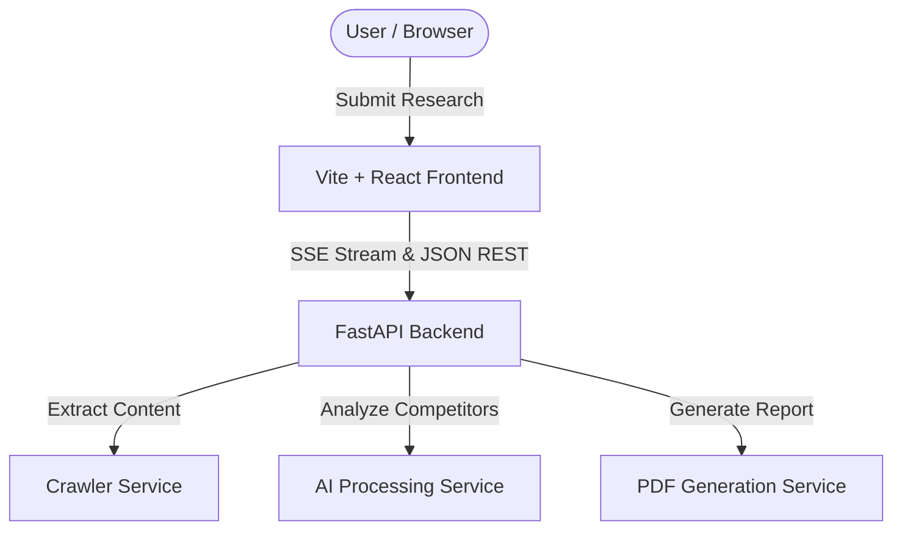

# IntelLens - AI-Powered Company Research Assistant

IntelLens is an enterprise-grade Company Research Assistant that crawls targeted websites, identifies key market offerings, pain points, and tech stacks, discovers competitors using Serper.dev and AI reasoning, and compiles strategic dossiers, PDF downloads, and contextual Q&A chat instances.

---

## System Architecture



1. **Vite + React Client**: Built with Tailwind CSS, Lucide icons, and modern glassmorphism dashboards. Employs Server-Sent Events (SSE) to display crawler progress.
2. **FastAPI Server**: High-performance asynchronous endpoint handler parsing requests, queuing scraper workers, and serving binary PDF outputs.
3. **Structured Crawler**: Restricts crawls according to `robots.txt` specifications, filters noisy pages, and normalizes URLs up to depth 2.
4. **OpenRouter AI Processing**: Chains context extraction with structural Pydantic formatting to prevent model hallucinations.

---

## Directory Structure

```
intel-lens/
├── backend/
│   ├── app/
│   │   ├── api/             # API Endpoints
│   │   ├── core/            # Config & Security
│   │   ├── schemas/         # Pydantic schemas
│   │   └── services/        # Crawler, AI, Search, and PDF engines
│   └── requirements.txt
└── frontend/
    ├── src/
    │   ├── components/      # Progress, Dashboard, and Chat Panels
    │   ├── services/        # API client
    │   └── App.tsx          # Main entry screen
    └── package.json
```

---

## Getting Started

### 1. Backend Setup
```bash
cd backend
pip install -r requirements.txt
copy .env.example .env
# Edit your .env with your SERPER_API_KEY and OPENROUTER_API_KEY
python -m uvicorn app.main:app --reload
```

### 2. Frontend Setup
```bash
cd frontend
npm install
npm run dev
```

---

## Environment Variables

### Backend (`backend/.env`)
* `SERPER_API_KEY`: API Key from Serper.dev
* `OPENROUTER_API_KEY`: API Key from OpenRouter.ai

### Frontend (`frontend/.env`)
* `VITE_API_BASE_URL`: Url of FastAPI server (e.g. `https://intellens.onrender.com`)

---

# Deployment

The application is deployed as a full-stack web application.

* **Frontend:** Deployed on Vercel
* **Backend:** Deployed on Render

Replace the URLs below with your deployed application links.

```text
Frontend: https://your-frontend.vercel.app
Backend : https://your-backend.onrender.com
```

---

# Website Crawling Implementation

IntelLens performs intelligent website crawling to collect publicly available company information for analysis.

### Crawling Features

* Recursive website crawling with configurable depth
* `robots.txt` compliance
* URL normalization and duplicate removal
* Internal link discovery
* HTML content extraction
* Noise filtering (navigation, footer, boilerplate content)
* Structured text processing for AI analysis

The extracted content forms the knowledge base used throughout the research pipeline.

---

# AI Company Research

After the crawling process completes, IntelLens leverages OpenRouter-powered Large Language Models (LLMs) to generate comprehensive company intelligence.

The AI research includes:

* Company Overview
* Business Model
* Products & Services
* Industry Analysis
* Technology Stack
* Market Positioning
* Customer Pain Points
* Strengths & Opportunities
* Strategic Insights

Structured output is generated using Pydantic schemas to improve consistency and reduce hallucinations.

---

# Competitor Analysis

IntelLens automatically discovers competitors using Serper.dev search results combined with AI reasoning.

Each competitor profile includes:

* Company Name
* Business Summary
* Products & Services
* Competitive Advantages
* Market Position
* Comparison with the Target Company
* Key Differentiators

This enables users to understand the competitive landscape surrounding the researched company.

---

# PDF Generation

After completing the research process, IntelLens generates a professionally formatted PDF report.

The generated report contains:

* Company Profile
* Executive Summary
* Website Analysis
* AI Research Findings
* Competitor Analysis
* Technology Stack
* Business Insights
* Strategic Recommendations

The report is available for immediate download from the application.

---

# Discord Integration

IntelLens includes Discord integration for automated report sharing.

The application provides a dedicated configuration section containing:

* Discord Bot Token
* Discord Channel ID
* Applicant Name
* Applicant Email Address

After a report is successfully generated, the application automatically sends the following information to the configured Discord channel:

### Applicant Details

* Applicant Name
* Applicant Email Address

### Research Details

* Company Name
* Company Website

### Attachment

* Generated PDF Report

This integration demonstrates:

* Discord Bot API integration
* API authentication
* File upload functionality
* Workflow automation
* Third-party service integration

---

# Deliverables

This submission includes:

* Source Code
* Deployment URL
* README Documentation
* Setup Instructions
* Environment Variable Documentation
* Website Crawling Implementation
* AI Company Research
* Competitor Analysis
* PDF Generation
* Discord Integration

---

# Workflow

```text
User Input
     │
     ▼
Website Crawling
     │
     ▼
Content Extraction
     │
     ▼
AI Company Research
     │
     ▼
Competitor Discovery
     │
     ▼
Strategic Analysis
     │
     ▼
PDF Generation
     │
     ▼
Discord Report Sharing (Optional)
```
